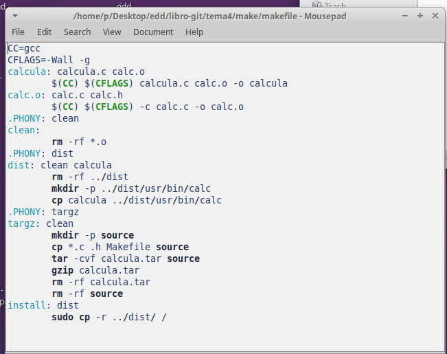
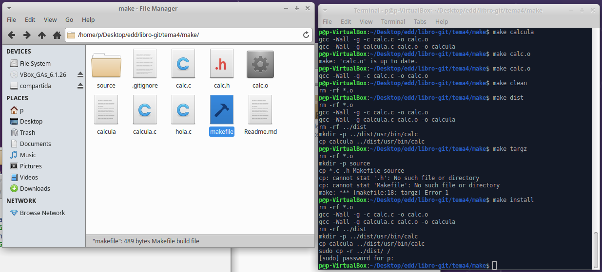
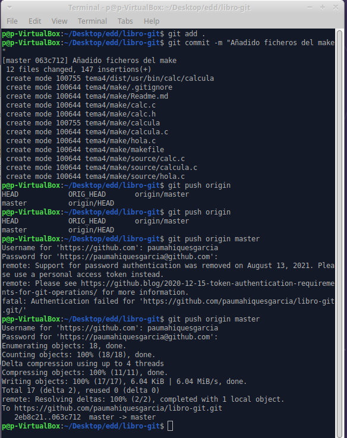

---   
title: Ejercicios de creación y actualización de repositorios
titlepage: true
titlepage-rule-height: 0
titlepage-rule-color: 653097
toc-own-page: true
toc-title: Contenidos
header-includes:
	- \usepackage{lastpage}
header-left: EDD
header-right: Ejercicios git
lang: es-ES
footer-left: Pau Mahiques Garcia
footer-right: \thepage/\pageref{LastPage}
titlepage-background: /home/pau/edd/fondo.jpg

---
# Memoria Make

1. Crear carpeta en el repositorio
~~~
mkdir tema4
~~~
2. Crear una carpeta para el make
~~~
mkdir make
~~~
3. Añadimos los archivos c que hicimos anteriormente (calc.c, calc.h, calcula.c y hola.c)
4. Creamos el archivo Readme.md donde expliocaremos los pasos realizados
~~~
gedir Readmi.md
~~~
5. Creamos un gitignore para ignorar los archivos .o (*.o)
~~~
gedit .gitignore
~~~
6. creamos el archivo make
~~~
gedit makefile
~~~
7. Lo editamos
    
8. Lo ejecutamos parte por parte
    
9. Para terminar lo subimos a github
    